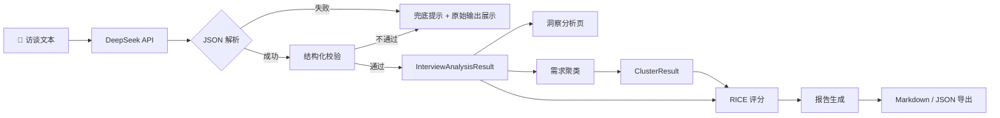
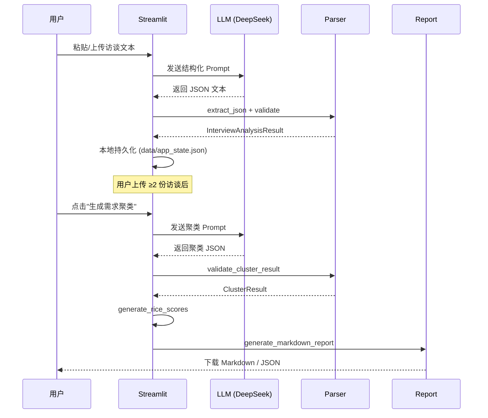

# InsightFlow AI｜AI 用户访谈分析工具

> 将用户访谈文本自动转化为结构化需求洞察——从原始对话到优先级评分，一站式完成。

## 1. 项目背景

用户访谈是产品经理获取需求洞察的核心手段，但访谈文本的分析过程耗时且依赖经验：手动标注痛点、归纳需求、跨访谈对比，往往占据研究周期 60% 以上的时间。

InsightFlow AI 利用大语言模型的结构化输出能力，将访谈分析流程从"人工逐行标注"转变为"AI 提取 + 人工审核"，在保证洞察可溯源的前提下，将单份访谈的分析时间从 30-60 分钟压缩到 1-2 分钟。

## 2. 核心功能

| 模块 | 功能 | 输出 |
|------|------|------|
| 📝 访谈输入 | 粘贴文本 / 上传 .txt 文件 | 原始文本入库 |
| 🔍 单访谈分析 | AI 提取用户画像、痛点、需求、情绪、标签 | `InterviewAnalysisResult` |
| 🔗 需求聚类 | 多访谈交叉分析，识别共性需求 | `ClusterResult` |
| 📐 RICE 评分 | 机会点优先级量化评分 | `RiceScoreItem` 排序表 |
| 📄 报告导出 | Markdown / JSON 一键导出 | 完整洞察报告 |

**单份访谈可提取 9 类结构化字段：**

- 用户画像（角色、行业、技术水平、使用频率）
- 使用场景
- 痛点 + 用户原话证据（severity 1-5）
- 显性需求 + 来源
- 隐性需求 + 推断依据
- 情绪倾向（label + score + reason）
- 需求标签
- 产品机会点 + 关联痛点

## 3. 产品截图

<!-- 可替换为实际截图 -->

```
📊 项目看板    →  数据概览、KPI 卡片、最近分析
📝 新建访谈    →  文本输入 / 文件上传、AI 分析
🔍 洞察分析    →  用户画像、痛点卡片、情绪分布
🔗 需求聚类    →  跨访谈共性需求、标签统计
📐 RICE 优先级 →  评分表、排序、可视化图表
📄 报告导出    →  预览 + Markdown/JSON 下载
```

## 4. AI 工作流



**完整数据流：**



## 5. 技术架构

```
┌─────────────────────────────────────────────┐
│                  Streamlit                   │
│  (页面渲染 + 交互 + Session State + 持久化)    │
├──────────┬──────────┬───────────┬───────────┤
│ ui_comp  │  visual  │  scoring  │  report   │
│  组件库   │ Plotly   │  RICE算法  │  生成器    │
├──────────┴──────────┴───────────┴───────────┤
│              schemas (数据模型)               │
├─────────────────────────────────────────────┤
│   parser (JSON提取+校验)  │  prompts (模板)  │
├──────────────────────────┴──────────────────┤
│              llm_client (HTTP)               │
├─────────────────────────────────────────────┤
│              config (环境变量)                │
└─────────────────────────────────────────────┘
```

**设计原则：**

- **单一职责**：每个模块只做一件事（`parser` 只解析，`scoring` 只算分）
- **数据模型先行**：所有数据结构定义在 `schemas.py`，其他模块依赖数据类而非原始 dict
- **LLM 可替换**：`llm_client.py` 封装了 HTTP 调用，切换模型只需改 `config.py`
- **本地持久化**：分析结果自动保存到 `data/app_state.json`，刷新不丢失

## 6. 项目目录结构

```
InsightFlow-AI/
├── app.py                 # 主应用：6 个页面渲染 + 导航
├── ui_components.py       # UI 组件库 + 全局 CSS
├── visualization.py       # Plotly 图表（标签频次/情绪/痛点/RICE）
├── schemas.py             # 数据模型（dataclass）
├── parser.py              # JSON 提取 + 结构化校验
├── prompts.py             # Prompt 模板（访谈分析 + 聚类）
├── llm_client.py          # LLM API 调用（重试 + 超时）
├── scoring.py             # RICE 评分算法
├── report_generator.py    # Markdown 报告生成
├── config.py              # 环境变量配置
├── requirements.txt       # 依赖清单
├── run.bat                # Windows 一键启动脚本
├── .env.example           # 环境变量模板
├── sample_data/           # 5 份示例访谈文本
│   ├── interview_01.txt
│   ├── interview_02.txt
│   ├── interview_03.txt
│   ├── interview_04.txt
│   └── interview_05.txt
└── data/                  # 运行时数据（自动生成，已 gitignore）
    └── app_state.json
```

## 7. 快速开始

### 环境要求

- Python 3.10+
- DeepSeek API Key（[获取地址](https://platform.deepseek.com/api_keys)）

### 安装步骤

```bash
# 1. 克隆项目
git clone https://github.com/your-username/InsightFlow-AI.git
cd InsightFlow-AI

# 2. 安装依赖
pip install -r requirements.txt

# 3. 配置环境变量
cp .env.example .env
# 编辑 .env，填入你的 DEEPSEEK_API_KEY

# 4. 启动
streamlit run app.py
```

Windows 用户可直接双击 `run.bat` 启动。

## 8. 环境变量配置

在项目根目录创建 `.env` 文件：

```env
# 必填
DEEPSEEK_API_KEY=sk-your-api-key-here
DEEPSEEK_BASE_URL=https://api.deepseek.com
DEEPSEEK_MODEL=deepseek-chat

# 可选（如需使用 OpenAI）
OPENAI_API_KEY=sk-your-openai-key
OPENAI_BASE_URL=https://api.openai.com/v1
OPENAI_MODEL=gpt-4o
```

## 9. 运行方式

```bash
# 方式一：命令行
streamlit run app.py --server.port 8501

# 方式二：指定 Python 版本
python3.12 -m streamlit run app.py --server.port 8501

# 方式三：Windows 双击
run.bat
```

启动后访问 http://localhost:8501

## 10. Prompt 设计

### 设计理念

Prompt 采用"**严格规则 + JSON Schema 示例**"双约束策略：

1. **输出格式约束**：要求 LLM 只输出 JSON，不输出 Markdown 代码块或解释性文字
2. **字段语义约束**：每个字段附带中文说明（如 `severity 为 1-5 的整数，5 表示最严重`）
3. **证据溯源约束**：`evidence` 字段必须逐字引用用户原话，不允许改写
4. **不确定性约束**：信息不确定时填写 `"unknown"`，不编造

### 访谈分析 Prompt 结构

```
角色设定 → 严格规则（7条） → JSON Schema 示例 → 访谈编号 → 访谈文本
```

### 聚类 Prompt 结构

```
角色设定 → 严格规则（5条） → JSON Schema 示例 → 多份访谈分析结果
```

### 模板转义

Prompt 中的 JSON 示例使用 `{{` / `}}` 转义，避免与 Python `.format()` 占位符冲突，仅 `{interview_id}`、`{interview_text}`、`{analysis_results}` 为真实占位符。

## 11. 幻觉控制设计

LLM 的幻觉是访谈分析的核心风险。本项目从三个层面控制：

| 层面 | 策略 | 实现 |
|------|------|------|
| **Prompt 层** | 明确禁止编造 | "如果信息不确定，填写 unknown，不要编造" |
| **Prompt 层** | 证据绑定 | "evidence 必须逐字引用用户原话，不允许改写" |
| **校验层** | 结构化校验 | `parser.py` 检查必填字段、数值范围、类型 |
| **展示层** | 原文可查 | 校验失败时展示 LLM 原始输出，供人工判断 |

**校验规则示例：**

```python
# severity 必须是 1-5 的整数
if not isinstance(sev, int) or sev < 1 or sev > 5:
    errors.append(f"pain_points[{i}] severity 必须是 1-5 的整数")

# emotion.score 必须在 -1 到 1 之间
if not isinstance(score, (int, float)) or score < -1 or score > 1:
    errors.append("emotion.score 必须是 -1 到 1 之间的数值")
```

**JSON 解析兜底：**

`parser.extract_json()` 支持三种格式提取：
1. 纯 JSON 文本
2. Markdown 代码块包裹的 JSON（` ```json ... ``` `）
3. 混合文本中提取花括号匹配的 JSON

## 12. 指标体系

### RICE 优先级评分

$$\text{RICE Score} = \frac{\text{Reach} \times \text{Impact} \times \text{Confidence\%}}{\text{Effort}}$$

| 维度 | 含义 | 取值范围 | 说明 |
|------|------|----------|------|
| Reach | 影响用户数 | 1-10 | 预估每季度受影响的用户量级 |
| Impact | 单用户影响度 | 1-10 | 对单个用户的价值大小 |
| Confidence | 信心系数 | 1-10 | 数据支撑程度，计算时 ÷10 转百分比 |
| Effort | 开发成本 | 1-10 | 所需人月投入 |

**优先级划分：**

| RICE 分数 | 优先级 | 含义 |
|-----------|--------|------|
| ≥ 5 | P0 | 立即执行 |
| 3-5 | P1 | 纳入规划 |
| < 3 | P2 | 暂缓评估 |

> MVP 阶段使用统一默认值（R=5, I=4, C=7, E=3），后续版本支持用户在 UI 中调整。

### 情绪分析

- **score**：-1（极消极）到 1（极积极）的连续值
- **label**：情绪标签（如积极/中性/消极/焦虑/兴奋）
- **reason**：情绪判断的文字依据

## 13. 后续迭代计划

- [ ] **RICE 参数可调**：支持用户在 UI 中调整各维度的默认值
- [ ] **PDF 导出**：基于 WeasyPrint 生成打印友好格式
- [ ] **CSV 数据导出**：结构化数据便于 Excel 分析
- [ ] **多模型支持**：支持 OpenAI / Claude / 本地模型切换
- [ ] **访谈对比视图**：多份访谈的痛点/需求并排对比
- [ ] **历史版本管理**：追踪分析结果的变化
- [ ] **团队协作**：多用户共享项目数据

## 14. 适合 AI 产品经理作品集的项目亮点

1. **完整的 AI 工作流设计**：从原始输入到结构化输出，覆盖 Prompt 设计 → JSON 校验 → 数据建模 → 可视化 → 报告导出的全链路

2. **幻觉控制实践**：不是简单调用 API，而是通过 Prompt 约束 + 结构化校验 + 证据溯源三层机制控制 LLM 输出质量

3. **可量化的优先级体系**：将模糊的"哪个需求先做"转化为 RICE 评分，让产品决策有数据支撑

4. **数据模型先行**：先定义 dataclass，再写业务逻辑——体现工程化思维

5. **用户体验闭环**：6 个页面覆盖"输入 → 分析 → 聚类 → 评分 → 导出"完整用户旅程，不是技术 demo

6. **本地持久化**：解决 Streamlit 刷新丢数据的问题，提升工具可用性

---

## License

MIT
